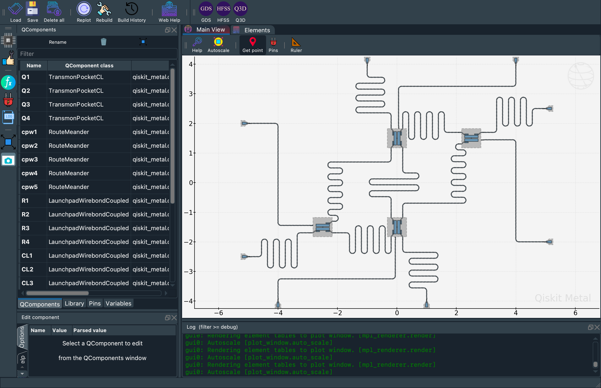

# 4-qubit Quantum processor Design using Qiskit Metal
Designing a 4-qubit superconducting quantum processor using Qiskit Metal.

## Results after LOM Analysis

### Qubits
| Qubit | Frequency (GHz) | Anharmonicity (MHz) | E_J (MHz)   | E_C (MHz)   | E_J/E_C   | T1 (us)  |
|-------|-----------------|---------------------|-------------|-------------|-----------|----------|
|  Q1   | 5.038986        | -296.183928         | 13616.300   | 258.992882  | 52.574    | 103.9605 |
|  Q2   | 5.106990        | -305.476596         | 13616.300   | 266.471547  | 51.098    | 50.2421  |
|  Q3   | 5.216237        | -320.804891         | 13616.300   | 278.739167  | 48.849    | 52.0519  |
|  Q4   | 5.305863        | -333.756017         | 13616.300   | 289.038656  | 47.109    | 77.0337  |

### Coupling Resonators
| Resonator    | Frequency (GHz) |
|--------------|-----------------|
| CPW1 (Q1,Q2) | 7.42            |
| CPW2 (Q2,Q3) | 7.36            |
| CPW3 (Q3,Q4) | 7.35            |
| CPW4 (Q1,Q3) | 6.73            |
| CPW5 (Q2,Q4) | 7.74            |

### Readout Resonators
| Resonator    | Frequency (GHz) |
|--------------|-----------------|
| OL1          | 6.98            |
| OL2          | 6.96            |
| OL3          | 6.98            |
| OL4          | 7.19            |

## NOTE:
This project is under progress and is subject to changes.
